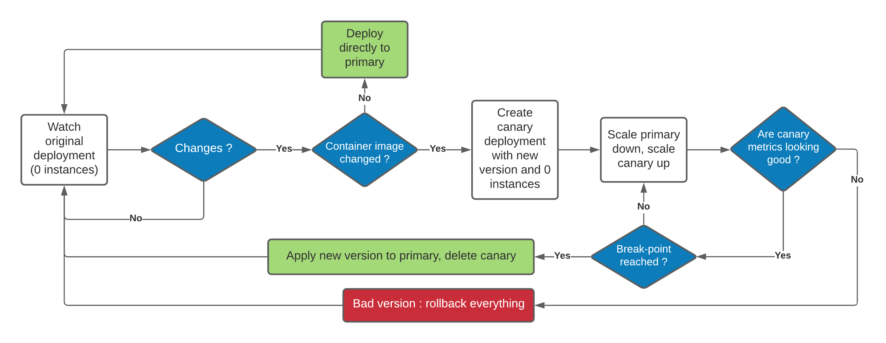

# Aviary

This is a progressive canary rollout controller for Kubernetes. It was developed to make deployments safer at [SEKOIA.IO](https://sekoia.io/).

## Logic



## Usage

1. Adapt the configuration to the services you want to deploy using Aviary, in `resources/kubernetes/config.yaml`

```yaml
prometheus-base-url: http://myprometheus:9090/
namespace: default

my-service-deployment:
  breakpoint: 50%
  step: 10%
  abort: 120s
  max_step_duration: 600s
  check_max_failures: 4
  check_success_step_duration: 120s
  start_delay: 60s
  success:
    - expr: rate(my_service_performance{kubernetes_pod_name="<<pod>>"}[1m]) > 500
    - expr: my_service_error_total{kubernetes_pod_name="<<pod>>"} == 0
```

The `<<pod>>` tags are dynamically replaced on runtime to watch the state of canary pods.

2. Deploy Aviary in your kubernetes cluster :

```
kubectl kustomize ./resources/kubernetes/ | kubectl apply -f -
```

3. Enjoy

On startup, the `-primary` and `-canary` deployments will be created from the base deployment.

Container image changes will be deployed progressively following the flowchart shown above.

## Operations

For some reason, you might want to bypass a canary deployment or abort an ongoing one. Aviary features an admin console that can be accessed by using `kubectl exec` on `cli.sh` in the pod, or simply connecting to port 8888 of the pod with `netcat` and `kubectl port-forward`.

The admin console is self documented and implements commands like `bypass` or `abort`.
